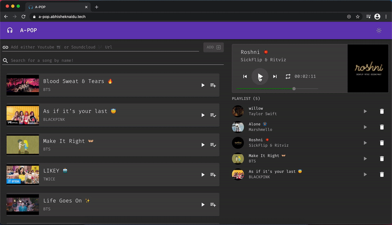

<div align="center">


# 🎶 A-POP

### Plataforma moderna de streaming musical en alta calidad

<p align="center">
  <strong>Escucha música en HD desde YouTube y SoundCloud sin anuncios, con una experiencia rápida, elegante y minimalista.</strong>
</p>

<p align="center">
  
  
  
  
</p>

<p align="center">
  
</p>

</div>

---

# 🌟 Acerca del Proyecto

**A-POP** es una aplicación web de streaming musical desarrollada para ofrecer una experiencia limpia, rápida y sin interrupciones.

La plataforma permite reproducir música desde múltiples fuentes como **YouTube** y **SoundCloud**, priorizando la calidad de audio y el rendimiento.

> 🎧 Música sin anuncios.  
> ⚡ Streaming rápido.  
> 🌙 Solo música y buenas vibras.

---

# ✨ Características

## 🎵 Streaming en Alta Calidad
- Reproducción HD
- Audio optimizado
- Bajo consumo de datos
- Streaming rápido y estable

---

## 🔍 Exploración Musical
- Buscar canciones
- Buscar artistas
- Buscar álbumes
- Tendencias musicales

---

## 🚀 Experiencia Moderna
- Interfaz minimalista
- Diseño responsive
- Navegación fluida
- Animaciones suaves

---

## ❤️ Funciones Sociales
- Compartir música
- Recomendaciones
- Historial de reproducción

---

## 🛡️ Sin Anuncios
- Experiencia limpia
- Sin interrupciones
- Reproductor enfocado en música

---

# 📸 Vista Previa

<div align="center">



</div>

---

# 🛠️ Tecnologías Utilizadas

<div align="center">


</div>

---

## ⚡ Stack Tecnológico

| Tecnología | Descripción |
|------------|-------------|
| React.js | Librería frontend |
| GraphQL | Gestión de APIs |
| Apollo Client | Manejo de estado y peticiones |
| Material UI | Componentes modernos |
| JavaScript | Lógica de aplicación |
| HTML5 | Estructura |
| CSS3 | Estilos |

---

# 📂 Estructura del Proyecto

```bash
A-POP/
│
├── public/
├── src/
│   ├── components/
│   ├── pages/
│   ├── graphql/
│   ├── hooks/
│   ├── assets/
│   └── styles/
│
├── package.json
└── README.md
```
---

# 🚀 Instalación

## 1️⃣ Clonar repositorio
```
git clone https://github.com/isairey/AppMusica.git
cd AppMusica
```
## 2️⃣ Instalar dependencias
```
npm install
```
## 3️⃣ Ejecutar proyecto
```
npm start
```
---

# 🌐 Abrir en el navegador
```
http://localhost:3000
```
🧪 Testing

Ejecutar pruebas:
```
npm test
```
Generar build de producción:
```
npm run build
```
---

# 📊 Roadmap

- Sistema de playlists
- Descarga offline
- Login social
- Recomendaciones inteligentes
- Aplicación móvil
- Letras sincronizadas
- Equalizador integrado
- Modo oscuro avanzado

 ---
 
# ⚙️ Rendimiento

- ✅ Optimizado para bajo consumo de datos
- ✅ Streaming rápido
- ✅ Interfaz ligera
- ✅ Compatible con móviles y escritorio

---

# 🤝 Contribuciones

Las contribuciones son bienvenidas 🚀


- Haz un Fork
- Crea una rama
- Realiza cambios
- Envía un Pull Request

---

# 📄 Licencia

Este proyecto está bajo la licencia MIT.

---

👨‍💻 Autor
**Isai Reyes**

Desarrollador Full Stack especializado en aplicaciones multimedia, streaming y tecnologías web modernas.

<p align="center"> <a href="https://github.com/isairey">  </a> </p>
